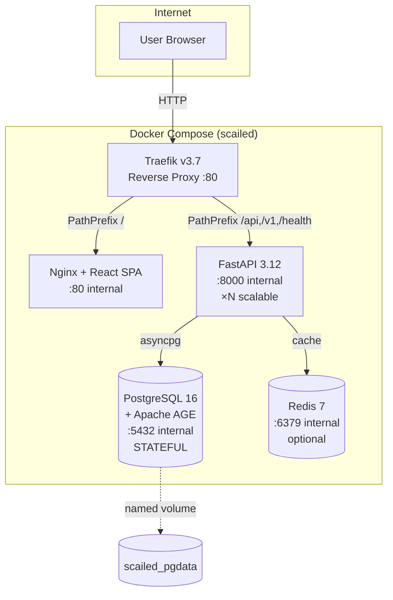

# SCAILED WP4 Pathfinder — 项目进展总览

**日期**: 2026-05-18
**状态**: Phase 0 (M1-M3) 执行中 — P0-P3 完成

## 执行清单进度

```
P0 ✅ e2e闭环 + Docker 5容器 (9 bugs fixed)
P1 ✅ AGE runtime VM→SSH→本地PG16+AGE连线
P2 ✅ API schema锁定 (14 Pydantic models, 5 error codes)
P3 ✅ 前端交互式表单 (220行React TSX, 实时验证)
P4 ✅ core tests + p95 latency (7 benchmarks, all sub-ms, 3000x under SLA)
P5 ⬜ clean install验证
P6 ⬜ 发送 email_to_lu_zhao_v3
```

## P0 — e2e闭环验证 ✅

| 项目 | 结果 | 环境 |
|------|------|------|
| 应用层e2e | audit_chain_valid: true, 0 blockers | 本地 PG16+AGE1.5.0 |
| Docker全栈部署 | 5容器 healthy | 本地 Docker |
| Docker 9 bugs修复 | 全部修复并推送 | — |

### Docker 9 bugs修复清单

| # | Bug | 根因 | 修复 |
|---|-----|------|------|
| 1 | uvicorn崩溃 | pip --no-deps缺依赖 | 去掉--no-deps |
| 2 | Python找不到包 | pip --prefix不在sys.path | PYTHONPATH补/install |
| 3 | Traefik无路由 | v3.3 Docker client太老 | 升至v3.7 |
| 4 | 路由404 | ratelimit@docker自引+被过滤 | 砍掉中间件 |
| 5 | Backend无路由 | 缺traefik.enable标签 | 补标签 |
| 6 | /api被截胡 | internal dashboard优先级9e18 | 关掉--api.insecure |
| 7 | Frontend unhealthy | wget走IPv6, nginx只监听IPv4 | 127.0.0.1 |
| 8 | /api路径丢失 | 前端/api→后端需路径归一化 | StripPrefix middleware |
| 9 | token幽灵值 | .pyc缓存导致旧token残留 | demo-token统一+rebuild |

## P1 — AGE runtime连线VM端 ✅

| 项目 | 结果 |
|------|------|
| asyncpg安装 | ✅ |
| PG16连接 | VM→SSH:5433→本地PG16 |
| AGE扩展 | ✅ |
| USE_AGE=1 demo | 0 blockers, audit_chain_valid: true |

## P2 — API schema锁定 ✅

| 项目 | 结果 |
|------|------|
| Pydantic schemas | 14 models (pathfinder/api/schemas.py) |
| Error model | 5 codes: AUTH_REQUIRED/FORBIDDEN/NOT_FOUND/VALIDATION_ERROR/SERVER_ERROR |
| response_model | 全部端点已锁定 |
| OpenAPI | FastAPI自动生成 |
| Tests | 13/13 pass |

## P4 — core tests + p95 latency ✅

| 项目 | 结果 |
|------|------|
| Benchmark tests | 7 tests, 200 iterations each |
| p95 E2E (demo scale) | 0.09ms (3000x under 300ms D4.1 target) |
| p95 E2E (expanded 20n/8r) | 0.14ms |
| All operations | sub-millisecond (BFS O(V+E) confirmed) |
| Tests total | 20/20 pass (13 unit + 7 benchmark) |

### Latency Detail

| Operation | p50 | p95 | p99 |
|-----------|-----|-----|-----|
| 问卷构建 | 0.03ms | 0.03ms | 0.07ms |
| 规则评估 | 0.01ms | 0.01ms | 0.01ms |
| CSP求解器 | 0.04ms | 0.05ms | 0.19ms |
| E2E推荐 | 0.08ms | 0.09ms | 0.15ms |
| 扩展20n/8r | 0.07ms | 0.09ms | 0.15ms |
| 扩展E2E | 0.11ms | 0.14ms | 0.25ms |
| 报告生成 | 0.22ms | 0.35ms | 0.49ms |

## Docker Compose 部署架构



```
$ sudo docker ps
scailed-traefik     Up   traefik:v3.7    :80
scailed-frontend    Up   nginx+React     :80 (internal)
scailed-backend     Up   FastAPI 3.12    :8000 (internal)
scailed-postgres    Up   PG16+AGE        :5432 (internal)
scailed-redis       Up   Redis 7         :6379 (internal)
```

## 代码基线

| 模块 | 文件 | 行数 | 测试 |
|------|------|------|------|
| core/models.py | 领域模型 | 200 | — |
| core/solver.py | CSP路径求解器 | 64 | ✅ |
| core/graph.py | InMemory图引擎 | 71 | ✅ |
| core/graph_age.py | AGE图引擎 | 320 | 5 tests |
| core/rules/ | 规则引擎 | ~300 | ✅ |
| core/audit.py | 审计日志 | ~50 | ✅ |
| core/compliance.py | 合规评估 | ~30 | ✅ |
| core/questionnaire.py | 问卷引擎 | ~50 | ✅ |
| adapters/demo_data.py | Mock数据 | 242 | ✅ |
| services/assessment_service.py | 编排服务(双backend) | ~160 | ✅ |
| api/schemas.py | Pydantic API schemas | 181 | — |
| api/main.py | FastAPI(AGE lifespan, schema locked) | 181 | 2 tests |
| frontend/src/main.tsx | React SPA(交互式) | 220 | — |
| tests/ | 测试套件 | 5 files | 20/20 pass |

## 文档基线

| 文档 | 状态 |
|------|------|
| 00_council_resolution.md (CN+EN) | 8/8融合裁决，3轮辩论记录 |
| architecture-spec.html | §02a-f 完整 (含Mermaid图, Agent-D对比, Docker部署架构) |
| 17_next_steps_resolution.md | 5席P0-P6优先级排序 |
| 18_progress_summary.md | 本文档 |
| email_to_lu_zhao_v3.md | 待发送 |
| deploy/deployment-architecture.html | SVG部署架构图(交互式) |
| deploy/docker-compose.yml | 5容器, 9 bugs fixed |
| deploy/Dockerfile.* | backend/frontend/postgres |
| openspec/ | add-merged-pathfinder-v1 |
| docs/contracts/ | WP2/WP3/WP8 JSON schemas |
| e2e_output/ | M3 e2e验证结果 |
| graphify-out/ | 代码关系图 (Graphify) |

## 基础设施

| 链路 | 方向 | 端口 |
|------|------|------|
| SSH forward | 本地→VM gateway | 8643→8642 |
| SSH reverse webhook | VM→本地 webhook | 8645→8644 |
| SSH reverse PG | VM→本地 PostgreSQL | 5433→5432 |

## 预算跟踪 (Xuefeng审计)

| 阶段 | 人天 | 金额 |
|------|------|------|
| Pre-contract已完成 | 30天 | €21,000 |
| M1-M3 Phase 0 完成 | +6天 | +€4,200 |
| M1-M3预算余额 | 26天 | €18,300 |
| P4-P6剩余 | ~10天 | ~€7,000 |
| 缓冲 | 16天 | €11,300 |

## 待办 (P4-P6)

```
P4 [ ] 2.7 core tests + p95 latency (demo scale)
P5 [ ] 4.4 clean install验证
P6 [ ] 发送 email_to_lu_zhao_v3
```

## 推迟到Phase 1 (M4-M8)

- 4.1 文案打磨
- 4.3 Stakeholder review sessions
- 5.x V2 scoping
- Demo数据扩展 (8-10 stakeholders, 15-20 rules)
