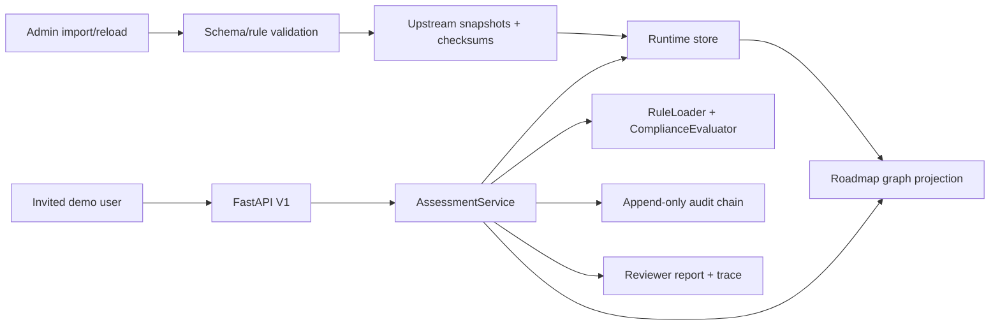

# fix: Close Pathfinder V1 Spec Drift

## Summary

This plan closes the gap between the current Pathfinder V1 demo proof and the OpenSpec/D4.1 acceptance baseline. The implementation should preserve the existing modular monolith, but replace scaffolded behavior with verifiable import activation, runtime persistence, complete audit coverage, security hardening, and acceptance-level verification.

---

## Problem Frame

The current codebase matches the demo skeleton and deterministic core direction, but several checked or implied capabilities remain scaffolded or unverified. The highest-risk drift is around controlled data imports, PostgreSQL/AGE runtime truth, audit completeness, rate limiting, and D4.1 acceptance evidence.

---

## Requirements

- R1. Admin imports for WP2/WP3/WP8 and demo inputs validate data before activation, normalize IDs, calculate checksums, store upstream snapshots, and emit import reports.
- R2. Runtime graph/data state aligns with the design decision that PostgreSQL/AGE is the primary deployed backend, while in-memory remains a demo/test fallback.
- R3. Recommendations, reports, rule reloads, imports, and degradation decisions are traceable through append-only audit events with previous-hash integrity.
- R4. API access controls are no longer hardcoded demo-only placeholders; admin endpoints remain protected and rate limiting is implemented for V1 demo scale.
- R5. The UI and report outputs make mock data, incomplete upstream inputs, unverified compliance, and traceability understandable to reviewers.
- R6. Acceptance verification covers at least five stakeholder types, three executable recommendation paths, rule test outcomes, report export, audit coverage, p95 latency, and Docker Compose startup.
- R7. OpenSpec tasks and implementation summary docs accurately reflect what is implemented, verified, and intentionally deferred.

---

## Scope Boundaries

- Do not add production user registration, OAuth/OIDC, password reset, or full RBAC.
- Do not add AI/RAG/GraphRAG recommendation generation.
- Do not add real HDAB/SPE/AI Factory/hospital production integrations.
- Do not introduce Kubernetes, Helm, Terraform, Neo4j, or microservices.
- Do not expand beyond D4.1/V1 acceptance unless a gap blocks the stated acceptance baseline.

### Deferred to Follow-Up Work

- Real consortium data curation: separate work once WP2/WP3/WP8 deliver signed structured inputs.
- Production observability stack: V2 or operations scope after D4.1 demo acceptance.
- Advanced frontend dashboards and multilingual UX: V2 scope.

---

## Context & Research

### Relevant Code and Patterns

- `pathfinder/services/assessment_service.py` is the current orchestration hub for questionnaires, graph selection, rules, solver, recommendations, imports, sessions, and audit.
- `pathfinder/core/models.py` already carries schema version, upstream snapshot version, trace records, rules, roadmap objects, and import reports.
- `pathfinder/core/rules/loader.py`, `pathfinder/core/rules/validator.py`, and `pathfinder/core/rules/compiler.py` provide the existing safe-activation rule pipeline to extend for reload behavior.
- `pathfinder/core/audit.py` provides an in-memory append-only hash chain; `deploy/pg-init/02_schema.sql` defines a persisted audit table with no-update/no-delete triggers.
- `pathfinder/api/main.py` exposes the V1 REST surface and currently contains hardcoded demo/admin tokens plus scaffolded import endpoints.
- `frontend/src/main.tsx` implements a single-page guided demo flow and report display.
- `deploy/docker-compose.yml` defines Traefik, frontend, backend, PostgreSQL/AGE, Redis, named volumes, and health checks; `docker compose config` already validates the static configuration.
- `graphify-out/GRAPH_REPORT.md` identifies `AssessmentService`, `AgeRoadmapGraph`, `QuestionnaireEngine`, `RuleLoader`, and `AuditLog` as core hubs, supporting the plan focus.
- `.code-review-graph/graph.db` confirms the main file summaries and core/API method surfaces used in this plan.

### Institutional Learnings

- No `docs/solutions/` directory was found during planning; there are no local learning notes to carry forward.
- `docs/D4_1_technical_appendix.md` explicitly lists open items for AGE runtime persistence, rate limiting, and Docker boot verification. Treat those as authoritative gap acknowledgements.

### External References

- No external research was used. The work is driven by local OpenSpec, product/design docs, graphify/code graph context, and current implementation.

---

## Key Technical Decisions

- Keep `AssessmentService` as the application boundary, but separate demo fixture loading from activated runtime data. This preserves the existing hub while making imports and snapshots meaningful.
- Introduce a small repository/persistence boundary instead of letting API endpoints mutate ad hoc in-memory dictionaries. This lets deployed mode use PostgreSQL while tests can still use in-memory fakes.
- Treat AGE as the deployed graph projection, not the only domain store. Roadmap nodes, edges, sessions, audit events, rule versions, and snapshots need relational persistence; AGE can be loaded from those records for traversal/projection.
- Implement V1 rate limiting pragmatically at the API layer or reverse-proxy layer already in the deployment path. The acceptance need is reviewer/demo protection, not a full abuse-prevention platform.
- Add acceptance tests before changing high-risk behavior where practical. Current tests prove the happy path; the closure work needs characterization and regression coverage around imports, audit, reload safety, and Docker/runtime behavior.

---

## Open Questions

### Resolved During Planning

- Scope: Full closure plan, not demo-only or persistence-only.
- Frontend framework: React is already resolved in the design and implementation.
- Primary implementation posture: characterize current behavior first, then replace scaffolded areas behind existing API contracts.

### Deferred to Implementation

- Exact persistence abstraction names and final query helpers: decide while editing the current service/API code.
- Whether V1 rate limiting lands in FastAPI middleware, Traefik labels, or both: decide after checking which route is simplest and testable without overbuilding.
- Whether AGE shortest-path should be used directly for V1 or remain a verified fallback projection: decide after a real deployed backend test proves the driver/query behavior.

---

## High-Level Technical Design

> *This illustrates the intended approach and is directional guidance for review, not implementation specification. The implementing agent should treat it as context, not code to reproduce.*

Core lifecycle:

1. Imports validate and activate data snapshots.
2. Assessment sessions bind questionnaire/rule/schema/snapshot versions.
3. Solver generates deterministic recommendations using the active graph/rules.
4. Every import, reload, answer submission, recommendation, report export, and degradation decision appends audit evidence.
5. Acceptance tests prove the flow across API, service, persistence, frontend contract, and deployment.

---

## Implementation Units

### U1. Import Activation and Snapshot Store

**Goal:** Replace scaffolded admin import responses with validated activation of WP2/WP3/WP8/demo data and durable import reports.

**Requirements:** R1, R3, R7

**Dependencies:** None

**Files:**
- Modify: `pathfinder/core/imports.py`
- Modify: `pathfinder/core/models.py`
- Modify: `pathfinder/services/assessment_service.py`
- Modify: `pathfinder/api/main.py`
- Modify: `pathfinder/api/schemas.py`
- Modify: `docs/contracts/wp2_stakeholder_taxonomy.schema.json`
- Modify: `docs/contracts/wp3_roadmap.schema.json`
- Modify: `docs/contracts/wp8_rules.schema.json`
- Test: `tests/test_pathfinder_core.py`
- Test: `tests/test_api.py`

**Approach:**
- Extend the import helper from checksum-only reporting into a typed validation/activation path for the three upstream contract families.
- Keep demo fixtures as the initial active snapshot, but make imports capable of replacing active stakeholder taxonomy, roadmap data, and rule bundles after validation.
- Ensure invalid imports return a rejected import report and leave the previous active snapshot unchanged.
- Record import audit events for success and failure.

**Execution note:** Start with failing API/service tests for valid import activation and invalid import rejection before changing the endpoints.

**Patterns to follow:**
- Rule activation safety in `pathfinder/core/rules/loader.py`.
- Existing `ImportReport` and version constants in `pathfinder/core/models.py`.
- Existing admin endpoint shape in `pathfinder/api/main.py`.

**Test scenarios:**
- Happy path: admin imports valid WP2 stakeholder taxonomy -> accepted report includes checksum, snapshot version, activated count, and service status reflects the new snapshot.
- Happy path: admin imports valid WP3 roadmap data -> subsequent roadmap endpoint returns the activated nodes/edges rather than only demo fixtures.
- Happy path: admin imports valid WP8 rule bundle -> rules validate, paired tests run, active rule version changes, and recommendations can use the new rules.
- Error path: invalid WP3 payload missing required fields -> endpoint returns validation error or rejected report, previous roadmap remains active, and audit records failed import.
- Error path: invalid WP8 rule bundle with failing paired tests -> previous active rules remain active and failed reload/import is audited.
- Integration: import success followed by assessment generation -> recommendation trace includes the active upstream snapshot version.

**Verification:**
- Admin imports no longer return scaffold-only messages.
- Import reports are visible from service status or admin status.
- Invalid imports cannot replace active runtime data.

---

### U2. Runtime Persistence and AGE Alignment

**Goal:** Align deployed runtime behavior with the design decision that PostgreSQL/AGE is the primary backend while keeping in-memory mode for tests and demo fallback.

**Requirements:** R2, R6, R7

**Dependencies:** U1

**Files:**
- Modify: `pathfinder/core/graph_age.py`
- Modify: `pathfinder/core/graph.py`
- Modify: `pathfinder/services/assessment_service.py`
- Modify: `deploy/pg-init/02_schema.sql`
- Modify: `deploy/docker-compose.yml`
- Test: `tests/test_graph_age.py`
- Test: `tests/test_pathfinder_core.py`
- Test: `tests/test_api.py`

**Approach:**
- Introduce a small runtime store boundary that can hydrate questionnaires, roadmap nodes/edges, rules, sessions, snapshots, and audit data from the active backend.
- Make `USE_AGE` or deployed profile load graph data from activated persisted records, not only direct demo fixture calls.
- Decide during implementation whether V1 should use AGE shortest-path directly or keep Python BFS over persisted/projection data; either route must be verified and documented honestly.
- Fix DSN consistency between `deploy/docker-compose.yml` and the async driver expected by runtime code.

**Execution note:** Add characterization tests proving current in-memory behavior before changing backend selection.

**Patterns to follow:**
- Interface parity in `tests/test_graph_age.py`.
- Existing `InMemoryRoadmapGraph` method contract.
- Database table intent in `deploy/pg-init/02_schema.sql`.

**Test scenarios:**
- Happy path: in-memory mode still runs current tests and demo CLI unchanged.
- Happy path: AGE/deployed mode can connect, load activated roadmap records, and return roadmap data through the API.
- Integration: assessment recommendation in deployed mode uses the same active roadmap/rule versions shown in service status.
- Error path: database unavailable in deployed mode -> startup or health status reports a safe explicit failure rather than silently pretending persistence is active.
- Edge case: no activated WP3 roadmap exists -> fallback demo roadmap is used only with explicit mock/provisional warning and audit event.

**Verification:**
- Runtime backend mode is explicit in `/health`.
- The technical appendix no longer needs to say AGE persistence is only deployment SQL and not wired into runtime code.
- Docker Compose backend can use the configured database URL without manual edits.

---

### U3. Audit Coverage and Immutability

**Goal:** Make audit evidence complete for OpenSpec events and consistent across in-memory and persisted runtime modes.

**Requirements:** R3, R4, R6

**Dependencies:** U1, U2

**Files:**
- Modify: `pathfinder/core/audit.py`
- Modify: `pathfinder/services/assessment_service.py`
- Modify: `pathfinder/api/main.py`
- Modify: `deploy/pg-init/02_schema.sql`
- Test: `tests/test_pathfinder_core.py`
- Test: `tests/test_api.py`

**Approach:**
- Ensure all required event types are appended: session creation, answer submission, recommendation generation, report export, rule reload, data import, and graceful degradation.
- Pass request metadata into audit logging where available and hash IP/user-agent instead of storing direct values.
- Add persisted audit implementation or adapter if U2 introduces a store boundary; in-memory audit remains useful for unit tests.
- Verify no-update/no-delete database trigger behavior in a database-backed test or deployment smoke path.

**Execution note:** Add audit event-count/type assertions around the existing end-to-end tests before expanding behavior.

**Patterns to follow:**
- Existing `AuditLog.verify_chain()` behavior.
- No-update/no-delete trigger intent in `deploy/pg-init/02_schema.sql`.

**Test scenarios:**
- Happy path: full assessment flow records session, answers, recommendation, and report events in order with valid previous hashes.
- Happy path: successful import and successful rule reload append audit events with relevant version/checksum metadata.
- Error path: failed import or failed rule reload appends a failure audit event and preserves active data.
- Integration: API requests that include client metadata produce hashed metadata in audit events, with no raw IP/user-agent stored.
- Error path: attempted persisted audit update/delete is rejected by the database trigger or equivalent adapter contract.

**Verification:**
- Acceptance audit event list is covered by tests.
- `audit_chain_valid` remains true after all supported V1 flows.
- Audit metadata privacy requirement is demonstrably satisfied.

---

### U4. API Hardening and Rate Limiting

**Goal:** Replace placeholder access/security behavior with V1-grade controlled demo access, admin protection, safe errors, and rate limiting.

**Requirements:** R4, R6

**Dependencies:** U3

**Files:**
- Modify: `pathfinder/api/main.py`
- Modify: `pathfinder/api/schemas.py`
- Modify: `deploy/docker-compose.yml`
- Modify: `deploy/deployment-architecture.html`
- Test: `tests/test_api.py`

**Approach:**
- Move demo/admin tokens out of hardcoded constants and into environment-backed configuration with safe local defaults only when explicitly in demo mode.
- Add rate limiting at the simplest V1-appropriate layer: FastAPI middleware for testability, Traefik labels for deployed protection, or both if low-cost.
- Keep existing error model shape but ensure unexpected exceptions do not leak internal details.
- Preserve current endpoint routes unless a change is required for correctness.

**Execution note:** Start with request-level tests for auth, admin protection, and rate-limit behavior.

**Patterns to follow:**
- Existing standardized `ApiError` schema.
- Existing `require_demo_token` and `require_admin_token` route guards.
- Traefik middleware labels already used for API path stripping in `deploy/docker-compose.yml`.

**Test scenarios:**
- Happy path: valid demo token can access questionnaire and assessment endpoints.
- Happy path: valid admin token can access import and rule reload endpoints.
- Error path: demo token cannot access admin import/reload endpoints.
- Error path: missing/invalid token receives standardized auth error.
- Error path: repeated requests past the configured V1 limit receive a safe rate-limit response.
- Edge case: health endpoint remains usable for deployment health checks without weakening protected V1 flows.

**Verification:**
- Tokens are configurable.
- Admin endpoints are protected and rate-limited.
- API tests cover both public demo and admin paths.

---

### U5. Reviewer-Facing UI and Report Truthfulness

**Goal:** Ensure the frontend and report output clearly expose mock-data mode, incomplete inputs, traceability, blockers, and unverified compliance in reviewer-friendly language.

**Requirements:** R5, R6

**Dependencies:** U1, U3, U4

**Files:**
- Modify: `frontend/src/main.tsx`
- Modify: `frontend/src/styles.css`
- Modify: `frontend/package.json`
- Modify: `pathfinder/services/assessment_service.py`
- Modify: `pathfinder/api/schemas.py`
- Test: `tests/test_api.py`
- Test: `frontend/src/main.test.tsx`

**Approach:**
- Move beyond raw JSON report display where feasible: show a compact readiness summary, recommended path, blockers/warnings, and trace IDs as reviewer-facing sections.
- Keep the raw JSON available only as secondary evidence if useful for D4.1 technical review.
- Ensure report payload includes enough stable fields for the frontend to render explicit mock/provisional/unverified states.
- Avoid adding broad dashboard scope; this is acceptance polish for the guided flow and report surface.

**Patterns to follow:**
- Existing single-page React structure in `frontend/src/main.tsx`.
- Existing report payload from `AssessmentService.report`.
- Mock-data warning copy in `docs/D4_1_technical_appendix.md`.

**Test scenarios:**
- Happy path: completed assessment shows stakeholder type, readiness snapshot, recommended path, trace IDs, and audit-chain status.
- Happy path: mock-data mode is visible before submission and in the final report.
- Error path: API validation error is rendered as a safe reviewer-facing message.
- Edge case: recommendation with blockers shows blocker state instead of implying a ready path.
- Integration: frontend build succeeds with updated API/report types.
- Integration: frontend component test renders mock-data warning, trace section, and blocker/warning state from representative report payloads.

**Verification:**
- Reviewers can understand the D4.1 demo flow without reading raw JSON.
- Mock/incomplete/unverified data states are visible in both UI and exported/report payload.

---

### U6. Acceptance Verification Suite

**Goal:** Add explicit automated and documented verification for the D4.1 acceptance baseline.

**Requirements:** R6, R7

**Dependencies:** U1, U2, U3, U4, U5

**Files:**
- Modify: `tests/test_pathfinder_core.py`
- Modify: `tests/test_api.py`
- Modify: `tests/test_demo_cli.py`
- Modify: `tests/test_graph_age.py`
- Create: `tests/test_acceptance_baseline.py`
- Modify: `docs/D4_1_demo_script.md`
- Modify: `docs/D4_1_technical_appendix.md`
- Modify: `e2e_output/` fixtures or generated evidence files as appropriate

**Approach:**
- Encode the acceptance checklist as tests where possible instead of relying on prose claims.
- Add at least three stakeholder/scenario answer sets that produce executable paths across demo stakeholder types.
- Add performance measurement at demo scale with a stable threshold and low-noise implementation.
- Add Docker Compose smoke verification documentation, and automate it if practical within local constraints.
- Keep generated evidence concise and repeatable; avoid making large generated artifacts the only proof.

**Execution note:** Build this as characterization of acceptance behavior before marking OpenSpec verification tasks complete.

**Patterns to follow:**
- Current end-to-end service/API tests.
- Existing `e2e_output/` evidence shape.
- Demo script wording in `docs/D4_1_demo_script.md`.

**Test scenarios:**
- Happy path: at least five stakeholder types each have a complete questionnaire.
- Happy path: at least three stakeholder/scenario fixtures produce ready recommendations with non-empty roadmap traces.
- Happy path: known WP8 demo rule tests match expected outcomes.
- Happy path: completed assessment report export includes readiness, path, blockers/gaps, compliance traceability, warnings, and disclaimer.
- Integration: full API flow creates session, submits answers, generates recommendation, exports report, and records required audit events.
- Performance: standard assessment submission plus recommendation generation meets p95 target at demo scale.
- Deployment: Docker Compose configuration and boot path are verified or documented with explicit local prerequisites and evidence.

**Verification:**
- D4.1 acceptance criteria can be checked from tests and documented smoke evidence.
- Unverified acceptance items remain visibly unchecked in OpenSpec/tasks until evidence exists.

---

### U7. OpenSpec, Docs, and Status Alignment

**Goal:** Make task checkboxes and implementation summary docs truthful after the code and verification changes land.

**Requirements:** R7

**Dependencies:** U1, U2, U3, U4, U5, U6

**Files:**
- Modify: `openspec/changes/add-merged-pathfinder-v1/tasks.md`
- Modify: `docs/D4_1_technical_appendix.md`
- Modify: `docs/D4_1_demo_script.md`
- Modify: `docs/12_merged_pathfinder_spec.md` only if acceptance wording needs clarification, not to weaken requirements.
- Modify: `graphify-out/` only by rerunning graphify/update if the team wants refreshed graph evidence.

**Approach:**
- Update task checkboxes only when implementation and verification evidence exists.
- Keep open items explicit rather than optimistic.
- Document which capabilities are demo-grade versus V2/deferred.
- Refresh graph/report artifacts only as supporting evidence, not as source of truth.

**Patterns to follow:**
- Current OpenSpec task file structure.
- D4.1 appendix “Open Implementation Items” section.

**Test scenarios:**
- Test expectation: none for docs-only edits, but reviewers should be able to map each changed checkbox to verification evidence.

**Verification:**
- OpenSpec validation remains strict-pass.
- The technical appendix no longer contradicts implementation state.
- The plan’s completed scope is discoverable from docs without reading commit history.

---

## System-Wide Impact

- **Interaction graph:** `AssessmentService` remains the central bridge between API, CLI, imports, rules, graph, audit, and reports; changes should preserve that boundary while making its backing data real.
- **Error propagation:** Import, reload, auth, rate-limit, graph, and persistence failures should return safe API errors and append audit events where required.
- **State lifecycle risks:** Import activation and rule reload must be atomic from the caller perspective; failed changes must preserve previous active data/rules.
- **API surface parity:** Service, API, CLI, frontend, and report outputs must agree on active schema/questionnaire/rule/snapshot versions.
- **Integration coverage:** Unit tests alone will not prove D4.1 readiness; API flow, CLI flow, frontend build, and deployment smoke evidence are all part of closure.
- **Unchanged invariants:** V1 remains deterministic, demo-scoped, and non-production; no AI recommendations or full auth platform are introduced.

---

## Risks & Dependencies

| Risk | Mitigation |
|------|------------|
| Persistence work expands into a full production platform | Keep scope to V1 runtime truth and acceptance; defer production auth/ops/multitenancy. |
| AGE behavior differs in real Docker runtime | Add a deployed-mode smoke path and keep in-memory fallback explicit for tests only. |
| Import validation becomes too broad | Implement the three current contract families first; treat unstructured extraction as follow-up unless required for acceptance evidence. |
| Rate limiting complicates local tests | Prefer a small configurable limiter and/or Traefik labels with focused tests. |
| Docs overstate completion again | Make U7 dependent on verification units; update checkboxes after evidence, not before. |

---

## Documentation / Operational Notes

- `docs/D4_1_technical_appendix.md` should become the reviewer-facing truth source for what is implemented, how to verify it, and what remains demo-scoped.
- `docs/D4_1_demo_script.md` should align with automated acceptance fixtures and avoid steps requiring hidden manual database edits.
- Deployment notes should state required environment variables for demo/admin tokens and database mode.
- If graphify remains part of the workflow, rerun graphify/update after implementation so architecture navigation reflects the closure work.

---

## Alternative Approaches Considered

- Demo-only closure: faster, but would leave the same persistence/import/audit drift that currently blocks honest OpenSpec acceptance.
- Persistence-first closure: stronger foundation, but would delay visible D4.1 acceptance evidence and frontend/report truthfulness.
- Full closure in one implementation stream: chosen because the gaps are coupled by acceptance traceability; sequencing still keeps units independently reviewable.

---

## Success Metrics

- All current verification commands still pass.
- OpenSpec strict validation passes.
- D4.1 acceptance baseline is covered by automated tests or documented smoke evidence.
- Admin import/reload endpoints are no longer scaffold-only.
- Deployed backend mode can demonstrate PostgreSQL/AGE-backed runtime behavior or explicitly documented fallback with audit warning.
- Technical appendix no longer lists AGE persistence, rate limiting, or Docker boot as unverified if those are completed.

---

## Dependencies / Prerequisites

- Existing Python/FastAPI and React toolchains remain available.
- Docker is available for deployment smoke verification when U6 runs.
- No real WP2/WP3/WP8 signed data is required; demo fixtures and contract-valid sample payloads are sufficient for V1 closure.

---

## Sources & References

- OpenSpec requirements: `openspec/changes/add-merged-pathfinder-v1/specs/merged-pathfinder/spec.md`
- OpenSpec design: `openspec/changes/add-merged-pathfinder-v1/design.md`
- OpenSpec tasks: `openspec/changes/add-merged-pathfinder-v1/tasks.md`
- Product spec: `docs/12_merged_pathfinder_spec.md`
- Technical design: `docs/13_merged_pathfinder_design.md`
- Execution plan: `docs/14_merged_pathfinder_plan.md`
- Technical appendix: `docs/D4_1_technical_appendix.md`
- Graph report: `graphify-out/GRAPH_REPORT.md`
- Core orchestration: `pathfinder/services/assessment_service.py`
- API surface: `pathfinder/api/main.py`
- Domain models: `pathfinder/core/models.py`
- Deployment: `deploy/docker-compose.yml`
