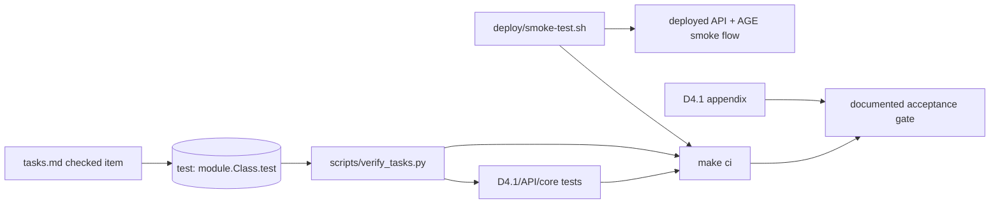

# fix: Close Council Reform Enforcement Gaps

## Summary

This plan closes the remaining council reform gaps exposed by the post-commit review: the task verifier must not produce false green results, checked OpenSpec tasks must carry explicit test mappings, smoke-test governance must become an executable gate, and the already-started R1-R4 reforms need verification cleanup so they are not only present in code but enforceable.

---

## Problem Frame

The latest review found that `scripts/verify_tasks.py --strict` exits successfully while verifying zero mapped checkboxes, and that the D4.1 appendix claims `deploy/smoke_test.py` is the sole acceptance gate without an actual gate hook. The broader council reform plans also contain partially implemented R1-R4 work that needs to be made coherent, tested, and wired into the same enforcement story.

---

## Requirements

- R1. D4.1 acceptance tests cover the seven acceptance criteria without relying on stale skips or broken assertions.
- R2. Deployed startup behavior fails explicitly when PostgreSQL/AGE dependencies are unavailable, while tests and demo mode opt into in-memory behavior deliberately.
- R3. Cross-cutting middleware enforces auth, rate limiting, and audit-whitelist checks without duplicating or conflicting with endpoint-level guards.
- R4. Post-deploy smoke testing is runnable from the repo and wired into a documented local/CI gate path.
- R5. `tasks.md` verification fails when checked tasks lack explicit test mappings, fails when mapped tests fail, and reports unmapped unchecked tasks without blocking.
- R6. Documentation and OpenSpec task status accurately distinguish machine gates, informational checks, skipped/deferred criteria, and verified behavior.

---

## Scope Boundaries

- Do not introduce a full production CI/CD platform beyond the minimum repository hook needed to make the smoke gate enforceable.
- Do not add production OAuth/OIDC, RBAC, user registration, or secret management beyond existing token configuration.
- Do not require a live Docker/AGE environment for normal unit tests.
- Do not implement real WP2/WP3/WP8 consortium data ingestion beyond the existing demo/admin import paths.
- Do not make p95 latency a hard CI gate; keep it informational per the council audit.

### Deferred to Follow-Up Work

- Full table-backed persistence for questionnaires, rules, sessions, snapshots, and audit data remains separate persistence work.
- Production observability and hosted CI policy configuration outside this repository remain operations scope.
- Real stakeholder validation sessions and Charite/Epidata feedback loops remain outside this enforcement-fix plan.

---

## Context & Research

### Relevant Code and Patterns

- `scripts/verify_tasks.py` parses checked `tasks.md` rows and shells out to pytest-style node IDs, but strict mode currently exits before checking unmapped checked rows when no annotations exist.
- `openspec/changes/add-merged-pathfinder-v1/tasks.md` has 16 checked items and zero `(test: ...)` annotations, which makes the verifier ineffective.
- `tests/test_d4_1_acceptance.py` exists and maps most D4.1 criteria, but some tests are skipped and one skipped audit test has an invalid event access pattern for `AuditEvent`.
- `pathfinder/services/assessment_service.py` already has `PATHFINDER_MODE` and `startup_check`, but startup checking exits the process and skips checks when called inside an event loop.
- `pathfinder/api/middleware.py` contains `AuditWhitelistMiddleware`, `DefaultDenyAuthMiddleware`, and `RateLimitMiddleware`; `pathfinder/api/main.py` also retains some duplicate helper code and endpoint-level auth calls.
- `deploy/smoke_test.py` and `deploy/smoke-test.sh` exist, but no `Makefile` or workflow config currently invokes them as an acceptance gate.
- `docs/D4_1_technical_appendix.md` states that the smoke test is the sole gate but its verification command list omits both the smoke test and task verifier.

### Institutional Learnings

- `docs/plans/2026-05-18-002-council-reforms-spec-enforcement.md` defines reforms R1-R6 and explicitly calls for test IDs in `tasks.md`.
- `docs/plans/2026-05-18-003-council-reform-audit.md` requires B1 gate ownership, B3 explicit task test annotations if R5 survives, a Python smoke test, startup-check test compatibility, and informational latency.
- The code-review finding established that documentation-only governance is insufficient: the machine gate must be runnable and discoverable.

### External References

- No external research was needed. The plan is grounded in local plans, code, and the reviewed diff.

---

## Key Technical Decisions

- Treat `scripts/verify_tasks.py --strict` as the local truth-checker for checked OpenSpec tasks. In strict mode, any checked item without a test mapping is a failure.
- Keep R5 as an informational/reporting tool outside the smoke gate unless explicitly invoked in a broader `ci` target. This honors the audit warning that R5 should not become a second acceptance gate.
- Use a repo-local `Makefile` as the minimum executable gate surface. It can define `test`, `smoke-test`, `verify-tasks`, and `ci` without requiring hosted CI setup.
- Keep latency tests skipped or informational in D4.1 acceptance tests. Functional correctness and smoke integration should gate; p95 can report separately.
- Prefer fixing the existing middleware and startup-check wiring over inventing another enforcement layer.

---

## Open Questions

### Resolved During Planning

- Scope: Broadened beyond the reviewed R5/R6 findings to include remaining council reform closure across R1-R4.
- Gate shape: Use a lightweight repo-local gate first (`Makefile` plus existing smoke wrapper), with optional GitHub Actions only if the repo already has workflow conventions.
- Task verifier semantics: Strict mode must fail on checked rows without mappings.

### Deferred to Implementation

- Exact test IDs to attach to every checked task: choose the narrowest existing acceptance/core/API test during implementation, adding missing tests only where no credible mapping exists.
- Whether to add a hosted workflow file: decide after checking repository ownership expectations; a `Makefile` target is the minimum plan requirement.
- Whether audit whitelist warnings should be asserted through logs or response-visible metadata: decide while improving tests around middleware behavior.

---

## High-Level Technical Design

> *This illustrates the intended approach and is directional guidance for review, not implementation specification. The implementing agent should treat it as context, not code to reproduce.*

---

## Implementation Units

### U1. Fix Task Verification Semantics

**Goal:** Make `scripts/verify_tasks.py` fail correctly when checked OpenSpec tasks are not test-mapped or when mapped tests fail.

**Requirements:** R5, R6

**Dependencies:** None

**Files:**
- Modify: `scripts/verify_tasks.py`
- Test: `tests/test_verify_tasks.py`
- Modify: `requirements.txt`

**Approach:**
- Treat checked `[x]` rows without `(test: ...)` as verification failures in `--strict` mode.
- Preserve non-strict behavior as a useful report: mapped checked tasks are executed, unmapped checked tasks are listed as unverified, and unchecked tasks remain informational.
- Add parser/unit tests using temporary task files rather than mutating the real OpenSpec file.
- Add `pytest` to the test/dev dependency surface, or change the runner to a dependency already guaranteed by the repo. Because existing tests use pytest markers, declaring pytest is the clearer fix.

**Execution note:** Start with a failing test that reproduces the current false green: one checked task, no annotation, `--strict` should exit non-zero.

**Patterns to follow:**
- Current parser structure in `scripts/verify_tasks.py`.
- Existing pytest-based acceptance tests in `tests/test_d4_1_acceptance.py`.

**Test scenarios:**
- Happy path: checked row with a passing test annotation exits `0` in strict mode.
- Error path: checked row without a test annotation exits non-zero in strict mode.
- Error path: checked row with a failing or invalid test ID exits non-zero.
- Edge case: unchecked row without annotation is reported but does not fail strict mode.
- Edge case: no checked rows produces a clear no-work report and exits `0`.

**Verification:**
- `scripts/verify_tasks.py --strict` can no longer pass when checked rows are unmapped.
- The verifier has direct unit coverage for parser and strict-mode behavior.

---

### U2. Add Explicit OpenSpec Test Mappings

**Goal:** Attach explicit test IDs to checked `tasks.md` items so R5 verifies real implementation evidence instead of only counting checkboxes.

**Requirements:** R5, R6

**Dependencies:** U1

**Files:**
- Modify: `openspec/changes/add-merged-pathfinder-v1/tasks.md`
- Modify: `tests/test_d4_1_acceptance.py`
- Modify: `tests/test_api.py`
- Modify: `tests/test_pathfinder_core.py`
- Modify: `tests/test_graph_age.py`
- Test: `scripts/verify_tasks.py`

**Approach:**
- Add `(test: module.ClassOrFunction.test_name)` annotations to every checked `[x]` task.
- Prefer existing tests that directly validate the task. Add focused tests only where no existing test proves the claim.
- Keep unchecked tasks unannotated unless they have an explicit non-gating informational marker added by implementation.
- Ensure annotation format matches what `scripts/verify_tasks.py` can execute.

**Execution note:** Work task-by-task: add the annotation, run the verifier, then add missing coverage only where the verifier exposes an unsupported claim.

**Patterns to follow:**
- D4.1 acceptance function names in `tests/test_d4_1_acceptance.py`.
- API import/rate-limit tests in `tests/test_api.py`.
- AGE/backend parity tests in `tests/test_graph_age.py`.

**Test scenarios:**
- Integration: all checked task annotations resolve to runnable test IDs.
- Error path: intentionally malformed task annotation in a temporary fixture fails verifier tests.
- Coverage: checked task rows that claim API hardening, report polish, acceptance latency, and graph traversal map to tests that exercise those behaviors.

**Verification:**
- Running the verifier in strict mode against real `tasks.md` reports mapped checked tasks and exits `0` only when their tests pass.

---

### U3. Finish D4.1 Acceptance Test Closure

**Goal:** Make the D4.1 acceptance test suite an accurate spec-to-test map, with only intentionally informational or deployment-only criteria outside unit-test gating.

**Requirements:** R1, R3, R4, R6

**Dependencies:** U1, U2

**Files:**
- Modify: `tests/test_d4_1_acceptance.py`
- Modify: `tests/test_api.py`
- Modify: `tests/conftest.py`
- Modify: `pathfinder/core/audit.py`
- Modify: `pathfinder/api/middleware.py`

**Approach:**
- Unskip the full API/audit acceptance test once middleware audit enforcement is testable, or replace the skip with an explicit test that validates the current enforceable behavior.
- Keep latency marked informational and ensure it is not included in the hard smoke gate.
- Keep Docker boot represented by the smoke test rather than a unit test that shells out to Docker during normal test runs.
- Fix any stale assertions against `AuditEvent` shape before unskipping audit-related tests.

**Execution note:** Characterize existing audit events first so middleware tests assert real behavior rather than a desired shape.

**Patterns to follow:**
- `AuditLog.events()` returns `AuditEvent` instances, not dictionaries.
- Existing API flow tests in `tests/test_api.py`.

**Test scenarios:**
- Happy path: full API flow creates assessment, submits answers, generates recommendation, exports report, and results in required audit event types.
- Integration: a deliberately mutating test endpoint or controlled route with no audit event triggers the audit whitelist warning.
- Error path: demo token still cannot access admin routes under middleware and endpoint guards.
- Edge case: health and docs routes remain public and are not rate-limited.
- Informational: p95 latency benchmark remains skipped or separated from hard gate behavior.

**Verification:**
- D4.1 acceptance tests explain which criteria are hard-gated, smoke-gated, or informational.
- No D4.1 acceptance test is skipped because of stale implementation gaps that have since been closed.

---

### U4. Normalize Startup and Middleware Enforcement

**Goal:** Ensure R2/R3 enforcement is coherent: deployed mode fails explicitly, demo/tests opt out deliberately, and middleware is the source of cross-cutting enforcement without redundant contradictory code.

**Requirements:** R2, R3, R4, R6

**Dependencies:** U3

**Files:**
- Modify: `pathfinder/services/assessment_service.py`
- Modify: `pathfinder/api/main.py`
- Modify: `pathfinder/api/middleware.py`
- Modify: `tests/conftest.py`
- Modify: `tests/test_api.py`
- Modify: `tests/test_pathfinder_core.py`

**Approach:**
- Replace process-level `sys.exit()` inside `AssessmentService.startup_check()` with an exception that the app lifespan can surface cleanly.
- Ensure tests opt into `startup_check=False` through fixtures or explicit constructor parameters without monkey-patching more broadly than necessary.
- Remove unused duplicate rate-limit/auth helper code from `pathfinder/api/main.py` once middleware owns that behavior.
- Verify middleware order with behavior tests rather than comments alone.

**Execution note:** Add failing tests for deployed-mode startup failure and middleware auth/rate-limit behavior before simplifying the implementation.

**Patterns to follow:**
- Existing `AgeRoadmapGraph.connect()` lifecycle.
- Current FastAPI lifespan setup in `pathfinder/api/main.py`.
- `ApiError` response shape in `pathfinder/api/schemas.py`.

**Test scenarios:**
- Error path: `PATHFINDER_MODE=deployed` with an unavailable database raises a clear startup error rather than silently using in-memory mode.
- Happy path: `PATHFINDER_MODE=demo` uses in-memory graph and passes normal service tests without external dependencies.
- Integration: admin token can access admin endpoints; demo token cannot.
- Integration: repeated protected requests past the configured rate limit receive `RATE_LIMITED`.
- Edge case: public health route is available without token and is not blocked by rate limiting.

**Verification:**
- Runtime mode is explicit in `/health`.
- There is one coherent auth/rate-limit path, and endpoint guards do not contradict middleware.

---

### U5. Wire the Smoke Gate

**Goal:** Make the governance statement actionable by adding a repository-local command surface that runs the smoke test as the acceptance gate.

**Requirements:** R4, R6

**Dependencies:** U3, U4

**Files:**
- Create: `Makefile`
- Modify: `deploy/smoke-test.sh`
- Modify: `deploy/smoke_test.py`
- Modify: `docs/D4_1_technical_appendix.md`
- Optional Create: `.github/workflows/pathfinder-smoke.yml`

**Approach:**
- Add `make test`, `make verify-tasks`, `make smoke-test`, and `make ci` targets.
- Keep `make smoke-test` as the governance gate wrapper around `deploy/smoke-test.sh`.
- Decide during implementation whether to add a hosted GitHub Actions workflow. If added, it should call the same repo-local targets rather than duplicating command logic.
- Ensure the smoke wrapper is honest about prerequisites: Docker Compose stack must already be up or the target must bring it up explicitly.
- Keep smoke test failures clear and non-zero.

**Execution note:** First run the smoke script in a dry or configuration mode if available; do not require a full Docker boot in unit-test verification.

**Patterns to follow:**
- Existing `deploy/smoke_test.py` step-based output.
- Existing Docker Compose file in `deploy/docker-compose.yml`.

**Test scenarios:**
- Happy path: smoke script exits `0` when deployed API returns graph backend `age`, imports data, completes assessment, and records audit events.
- Error path: smoke script exits non-zero when graph backend is `inmemory`.
- Error path: smoke script exits non-zero when required containers are absent or unhealthy.
- Documentation: `make ci` clearly includes the hard smoke gate and task verifier.

**Verification:**
- The repo has a single documented command that represents the acceptance gate.
- D4.1 appendix no longer claims a gate without naming how it is run.

---

### U6. Align Documentation and Governance Claims

**Goal:** Remove contradictory verification instructions and make docs reflect exactly what is hard-gated, informational, deferred, or manually validated.

**Requirements:** R4, R5, R6

**Dependencies:** U1, U2, U5

**Files:**
- Modify: `docs/D4_1_technical_appendix.md`
- Modify: `docs/D4_1_demo_script.md`
- Modify: `openspec/changes/add-merged-pathfinder-v1/tasks.md`
- Modify: `docs/plans/2026-05-18-002-council-reforms-spec-enforcement.md` if status notes are maintained there

**Approach:**
- Update the D4.1 verification section to include the acceptance gate, task verifier, normal unit test suite, compile check, frontend build, and OpenSpec validation.
- State that p95 latency is informational, not a hard CI gate.
- State that `scripts/verify_tasks.py` is a consistency checker for checked OpenSpec tasks, not a substitute for smoke-test acceptance.
- Make unchecked tasks remain visibly pending instead of masking them with annotations.

**Execution note:** Treat docs as acceptance artifacts: update them only after the corresponding command surface exists.

**Patterns to follow:**
- Existing appendix “Open Implementation Items” wording that distinguishes implemented vs deferred work.
- Council audit language in `docs/plans/2026-05-18-003-council-reform-audit.md`.

**Test scenarios:**
- Test expectation: none -- documentation-only unit. Verification is by consistency review against command targets and task annotations.

**Verification:**
- A reviewer can read the appendix and know exactly which command is the gate, which checks are supportive, and which items remain deferred.

---

## System-Wide Impact

- **Interaction graph:** API requests now pass through default-deny auth, rate limiting, audit whitelist, endpoint handlers, service audit events, and report generation. Tests must prove this path rather than only service-level behavior.
- **Error propagation:** Startup dependency failures should surface as explicit startup errors, not process exits inside domain service code or silent graph fallback.
- **State lifecycle risks:** Smoke tests mutate demo runtime data through admin imports; they should run against a disposable deployed environment or resettable demo state.
- **API surface parity:** CLI, API, and smoke test should all exercise the same service behavior and import/report contracts.
- **Integration coverage:** Unit tests prove service/API behavior; smoke test proves deployed container and AGE integration.
- **Unchanged invariants:** Demo mode remains zero-config, test mode does not require PostgreSQL, and p95 latency remains informational.

---

## Risks & Dependencies

| Risk | Mitigation |
|------|------------|
| Strict task verification blocks because too many checked rows lack direct tests | Add mappings incrementally and only add new tests for claims that are actually unsupported. |
| Smoke gate is too heavy for local development | Separate `make test` from `make ci`; document that `make ci` is the acceptance gate and requires Docker deployment prerequisites. |
| Middleware tests become brittle because they depend on Starlette internals | Assert behavior through TestClient responses and logged warnings, not internal middleware stack order. |
| Startup checks make import-time tests flaky | Keep startup dependency checks in service initialization/lifespan paths and provide explicit test fixtures for demo mode. |
| Documentation overclaims hosted CI enforcement | Only claim hosted enforcement if a workflow or required check is actually added; otherwise call it a local acceptance gate. |

---

## Verification Plan

- `scripts/verify_tasks.py --strict` fails on unmapped checked task fixtures and passes against real mapped `tasks.md`.
- D4.1 acceptance tests pass except criteria intentionally represented by smoke gate or informational benchmark.
- API middleware tests cover auth, rate limiting, audit whitelist warning, and health-route exemptions.
- Startup mode tests prove deployed mode refuses silent fallback and demo mode remains zero-config.
- Smoke-test wrapper is reachable through the documented gate command.
- D4.1 appendix and OpenSpec tasks describe the same gate/check split as the implementation.
