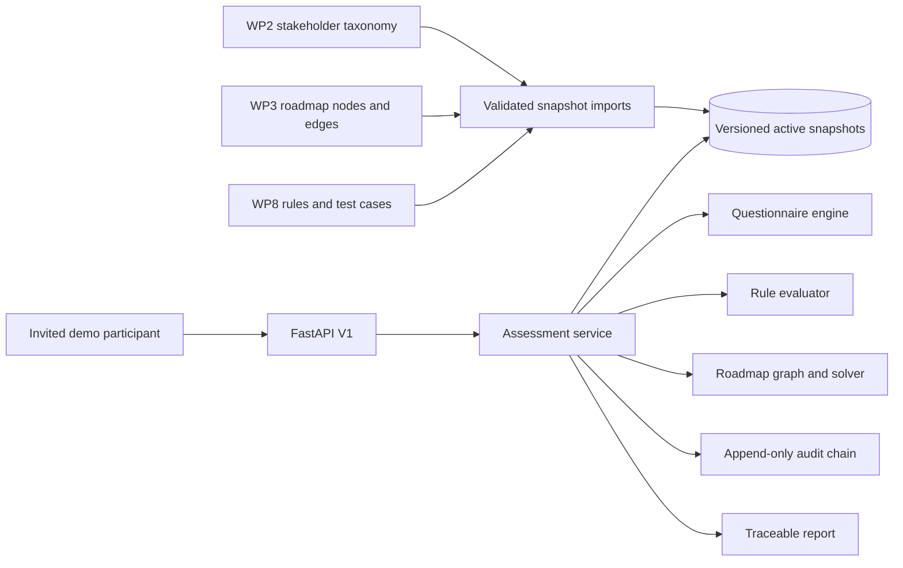
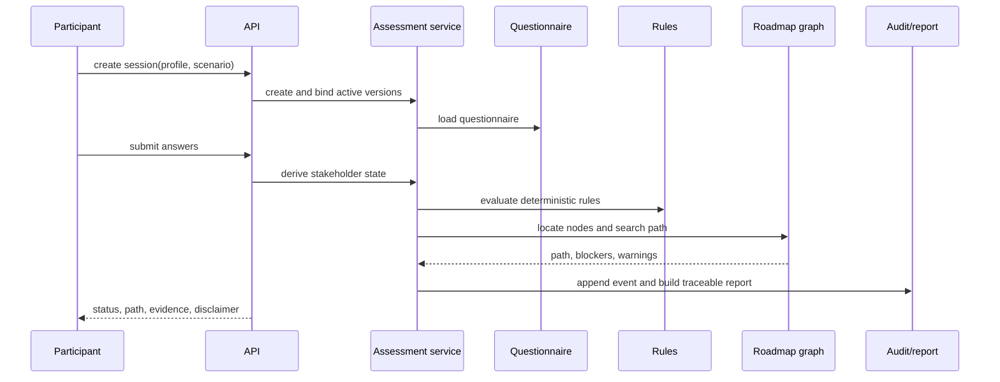
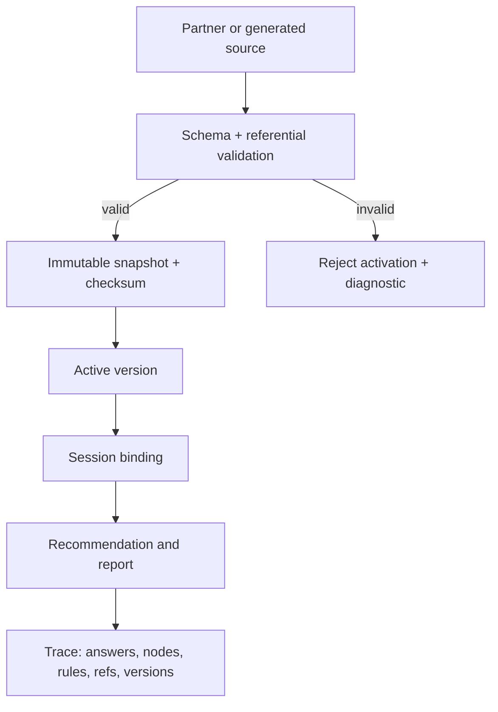

# Pathfinder V1 Architecture Diagrams

These diagrams are the proposal-level views. They intentionally show the V1 deterministic core; future AI/GraphRAG and production infrastructure are outside the acceptance baseline.

## Context and containers

## Assessment sequence

## Data lineage

