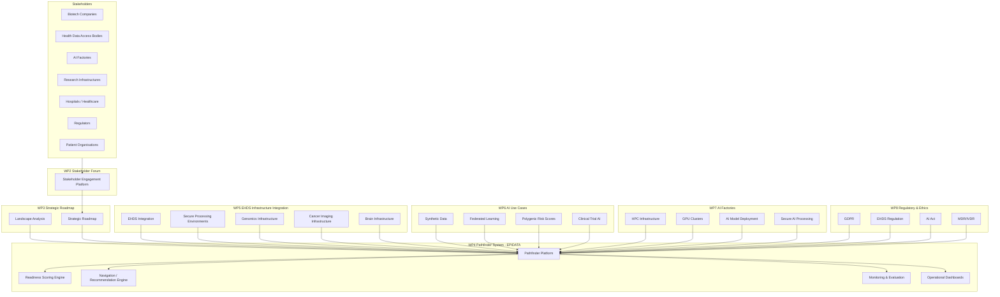
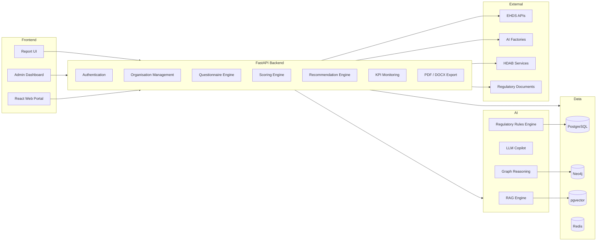
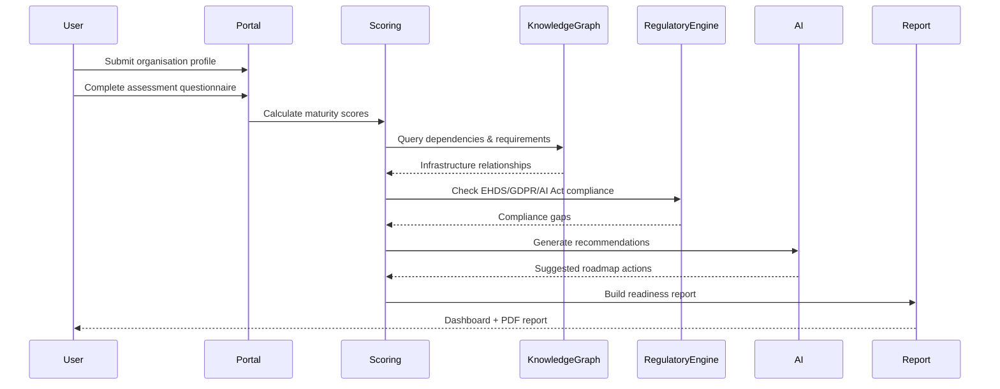
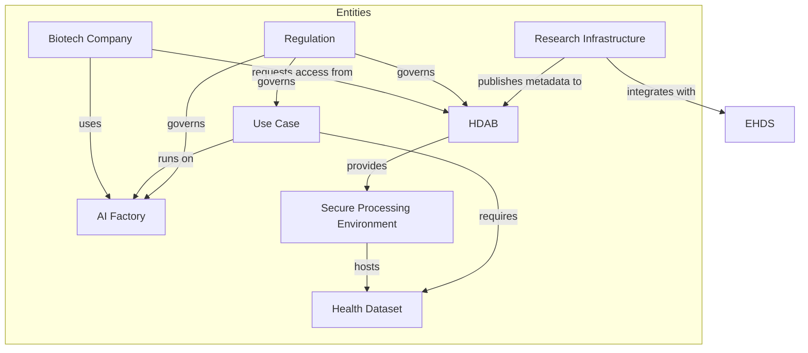
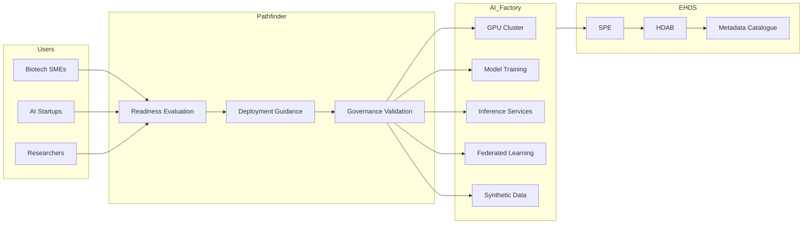
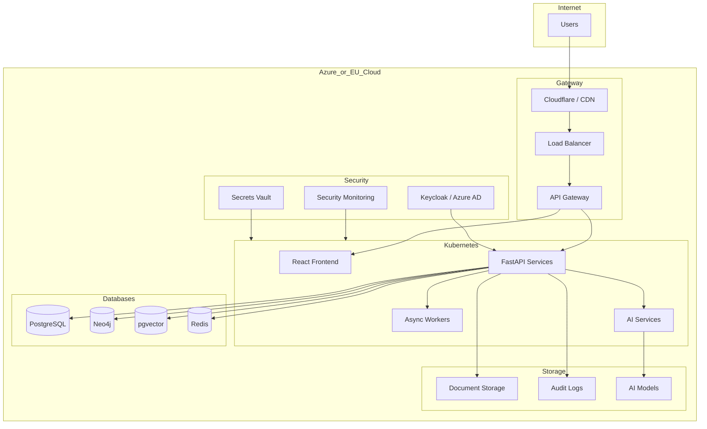

# SCAILED / EPIDATA Pathfinder Platform — Architecture Diagrams

## 1. Overall SCAILED System Architecture

---

# 2. EPIDATA Pathfinder Platform Architecture

---

# 3. Pathfinder Readiness Evaluation Workflow

---

# 4. EHDS Knowledge Graph Architecture

---

# 5. AI Factory Integration Architecture

---

# 6. Suggested Cloud-Native Deployment Architecture

